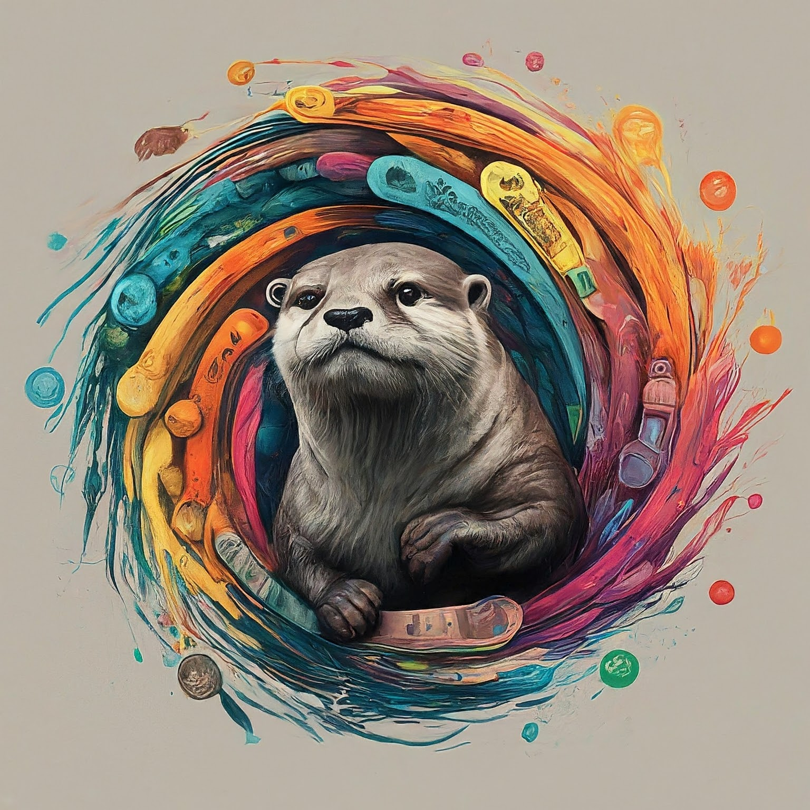

<!-- --- -->
[OTTER: Oncologic TranscripTome Expression Recognition](https://www.nature.com/articles/s41591-023-02221-x#Sec37)

Otter is a series of deep learning models aimed at classifying RNA TPM counts against an atlas of cancer types and subtypes. The original code for running Otter is available at https://github.com/shlienlab/otter.

<br>



# Otter API Wrapper 

This is a Python wrapper for the Otter API. This wrapper helps you run the API available at https://otter.ccm.sickkids.ca/.


[](https://pypi.org/project/otter-api-wrapper/)
[](https://pypi.org/pypi/otter-api-wrapper/)


## Installation 

```
pip install otter-api-wrapper
```

## Quickstart
You can check out the examples folder for more details. The simplest usage of the API is:
```python
from otter_api_wrapper import OtterAPI
from otter_api_wrapper.utils import save_plotly_figure
import pandas as pd

otter_api = OtterAPI(
    api_token='<your API token>'
)
df = otter_api.run_sample_path(
    file_path='examples/data/rhabdomyosarcoma.genes.hugo.results',
    model_name='otter',
    sample_name='rhabdo'
)
```

## Short Docs
Usually you want to start with creating an OtterAPI object:

```python
from otter_api_wrapper import OtterAPI

otter_api = OtterAPI(
    api_token='<your API token>' # You can find yours at https://otter.ccm.sickkids.ca/app/api_docs
)
```

Then, running a sample is the next step. This sends the sample to our servers and runs our models. The sample is only stored in the server during runtime and is deleted shortly after:

```python
df = otter_api.run_sample_path(
    file_path='<path_to_sample>',
    model_name='<otter, hierarchical>', # check http://localhost:3000/app/inference for details
    sample_name='<custom name for the sample>'
)
```

Details on the classes of the resulting dataframe can be found as an [Excel file](https://static-content.springer.com/esm/art%3A10.1038%2Fs41591-023-02221-x/MediaObjects/41591_2023_2221_MOESM3_ESM.xlsx) or if that link fails, as a supplementary table on the [paper](https://www.nature.com/articles/s41591-023-02221-x#Sec36).

From the dataframe, you can now generate all of the plots available on the webapp using the [Plotly](https://plotly.com/) library:

```python
# Returns a dictionary with top_path and sunburst_plot
plot_sample = otter_api.plot_sample(df)
```

The *top_path* key allows you to get the top path of subclasses based on the model classification. This is the same as you will find on the [results page](https://otter.ccm.sickkids.ca/app/results). The *sunburst_plot* key gives you access to the sunburst plot, also available on the results page.

If you want to retrieve plots from the explore page, you can do so by calling

```python
# returns age_plot, diagnosis_plot, and sex_plot
plot_explore = otter_api.get_explore_plots()

# or 

plot_explore = otter_api.get_explore_plots(class_name=plot_sample['top_path']['names'][-1]) # where class_name is the name of any class you are interested in
```

You can save any of the plots by using:

```python
from otter_api_wrapper.utils import save_plotly_figure

save_plotly_figure(plot_sample['sunburst_plot'], '<path to save file>')
```

## Citation
When using this library, please cite:

> Comitani, Federico, et al. "Diagnostic classification of childhood cancer using multiscale transcriptomics." Nature medicine 29.3 (2023): 656-666.

## Questions
If you have any questions about the API or the methods behind OTTER, please send an email to pedro.lemosballester@sickkids.ca or adam.shlien@sickkids.ca.
